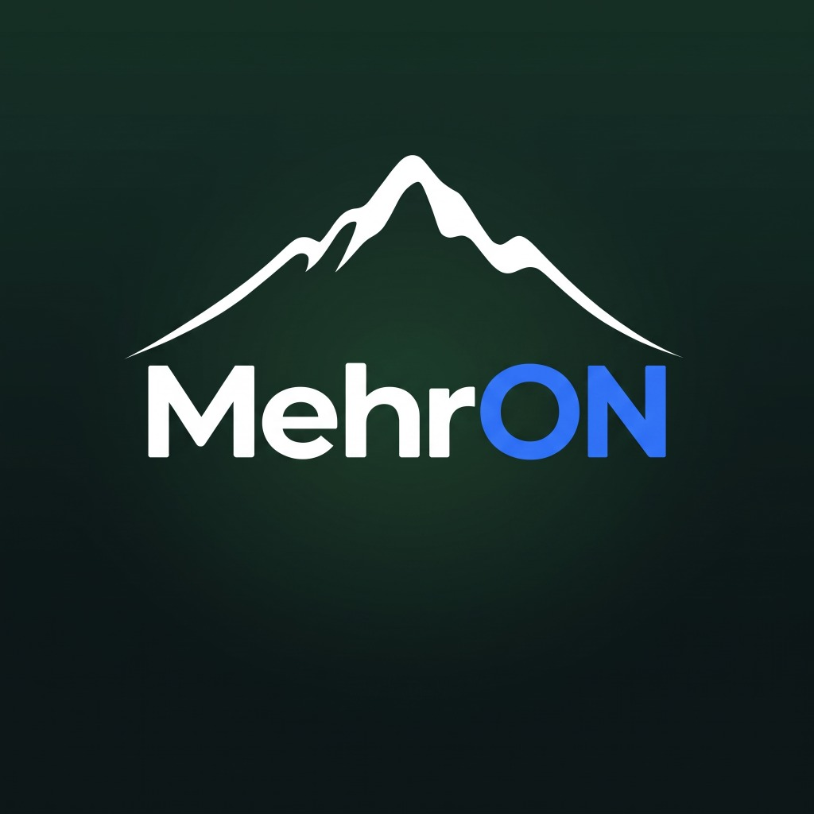

<p align="center">
  
</p>

<h1 align="center">MehrON</h1>

MehrON is a Windows desktop proxy client created from the PattN / Patterniha codebase, which is based on v2rayN. It provides a graphical interface for importing, organizing, testing, and running supported proxy profiles.

## Features

- Import and manage subscription links and supported share links.
- Test profile latency and control the Windows system proxy.
- Optional TUN mode for routing device traffic through the selected profile.
- Bundled Xray, sing-box, mihomo, and Aether runtime support in the portable release.
- Per-subscription update controls in Subscription Settings.
- Optional advanced settings for SNI spoofing and MHR integrations.

## Portable release

### Windows (x64)
The portable Windows package is distributed as `MehrON-windows-64.zip`.

1. Extract the archive to a writable folder.
2. Run `MehrON.exe`.
3. Accept the Windows administrator prompt when using TUN mode or other features that require elevated permissions.
4. Import a profile or add a subscription link.

### Linux (Ubuntu / Debian x64)
The portable Linux package is distributed as `MehrON-linux-64.tar.gz` and `MehrON-linux-64.zip`.

1. Extract the archive: `tar -xzf MehrON-linux-64.tar.gz`
2. Run `./MehrON` (or `sudo ./MehrON` when using TUN mode).
3. Import a profile or add a subscription link.

The release intentionally contains no saved profiles, subscriptions, logs, or generated runtime configuration files.

## Build from source

Requirements:

- Windows
- .NET SDK 10.0 (see `global.json`)

Build the desktop client from the repository root:

```powershell
dotnet build .\v2rayN\v2rayN.Desktop\v2rayN.Desktop.csproj -c Release
```

The output is written to:

```text
v2rayN\v2rayN.Desktop\bin\Release\net10.0\MehrON.exe
```

Runtime binaries are not produced by the .NET build. A portable release must include the required Xray, sing-box, mihomo, and Aether files beneath its `bin` directory.

## Repository layout

```text
v2rayN/                     Main desktop client source
_upstream_sni_spoofing/      SNI spoofing integration source
_upstream_mhr/               MHR integration source
_upstream_mhr_cfw/           MHR-CFW integration source
```

## Security and privacy

Do not commit or publish personal profiles, subscription URLs, generated `guiConfigs` folders, logs, or runtime `config.json` files containing credentials. Use placeholders in examples and keep private connection data outside the repository.

## License and acknowledgements

MehrON is distributed under the GPL-3.0 license; see [LICENSE](LICENSE). It was created from the PattN / Patterniha codebase and includes or integrates with third-party projects that have their own licenses and notices, including v2rayN, Xray-core, sing-box, Aether, MHR, MHR-CFW, and the SNI spoofing component.
